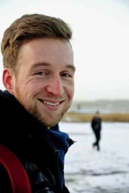

Hi, my name is Marco Gerstmann and I created DevTypes to connect the two topics software development and personal development. 

**DevTypes** stands for **Developer Types**. This is about software developers and their daily touch points at work.

Software developers are no longer only stereotypical strange guys spending their entire days programming all alone in a dark room.

You’ve probably even experienced it in your everyday life as a developer: Most of your work is shaped by **interaction and communication with other people**, such as product managers, software testers, business leaders, team leaders, and your co-developers.

Almost everything on this website is focused on this central topic. Apart from that the content is also enriched by the following interesting subjects:

- Team tools that enrich your everyday life as a team
- Software development processes and methods
- Software tools that make your everyday life as a developer easier
- Personal development to boost your life and career as a software developer
- And sometimes even a little code example

With this mix of topics I want to inspire you to make the most of you, your team and your career as a software developer.

## About me

I am a permanently employed software engineer since 2014 and have also gained much experience in programming as a working student.

I am currently working as a full-stack developer (Java Spring and Angular 2+) and part of an internationally distributed team with members from Germany, Spain and the USA.

Between 2016 and 2017, I successfully completed part-time training as a systemic coach.

In my free time I love to do physical activity, be it in the gym or in the garden.
